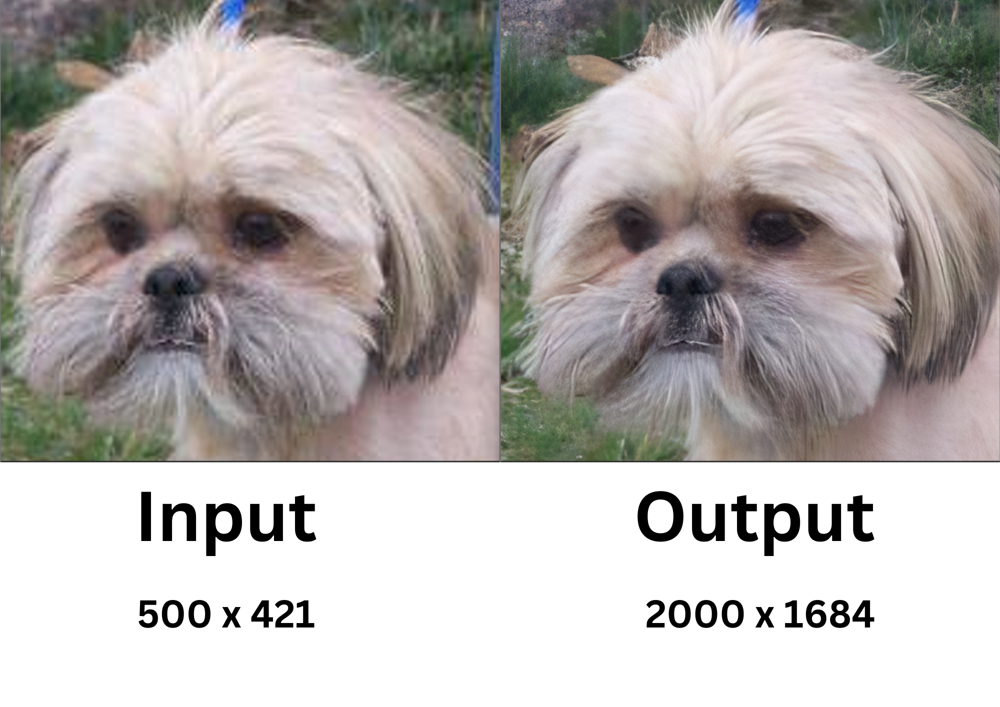

<div align="center">

# Pixteroid - AI-Powered Image Upscaling and Restorative API

<p id="intro">Pixteroid is a Node.js API designed for efficient image upscaling and restoration, powered by AI and utilizing the NCNN framework. It employs Real-ESRGAN and ESRGAN model weights to upscale and restore images, providing three distinct levels of detail and size customization to suit various needs.</p>


### Supported Platforms

[]()
[]()
[]()


---


<p>

<span>
  <a href="https://github.com/darsan-in/Pixteroid/commits/main">
    
  </a>
</span>

<span>
  <a href="">
    
  </a>
</span>

</p>

---

<p>

<span>
  <a href="LICENSE">
    
  </a>
</span>

<span>
  <a href="https://github.com/darsan-in/Pixteroid/releases">
    
  </a>
</span>

</p>

<p>

<span>
  <a href="https://www.codefactor.io/repository/github/darsan-in/Pixteroid/issues/main">
    
  </a>
</span>

</p>

---

<p>

<span>
  <a href="">
    
  </a>
</span>

<span>
  <a href="">
    
  </a>
</span>

</p>

---

<p>

<span>
  <a href="https://github.com/sponsors/darsan-in">
    
  </a>
</span>

</p>

---

</div>

## Table of Contents 📝

- [Features and Benefits](#features-and-benefits-)
- [Use Cases](#use-cases-)
- [Friendly request to users](#-friendly-request-to-users)

- [Installation - Step-by-Step Guide](#installation---step-by-step-guide-)
- [Usage](#usage)
- [In-Action](#in-action-)

- [License](#license-%EF%B8%8F)
- [Contributing to Our Project](#contributing-to-our-project-)
- [Website](#website-)

- [Contact Information](#contact-information)
- [Credits](#credits-)

## Features and Benefits ✨

* **AI-Powered Upscaling and Restoration**: Leverages AI-powered Real-ESRGAN and ESRGAN models to upscale and restore images with enhanced quality.
* **Multiple Detail Levels**: Offers three levels of detail to cater to different use cases, from quick previews to high-resolution prints.
* **Custom Size Scaling**: Supports custom size scaling to fit specific dimensions while preserving image quality.
* **Efficient Performance**: Built on the NCNN framework, ensuring optimized performance across different platforms.
* **Simple Integration**: Easily integrate into any Node.js project with straightforward API calls.
* **Open Source**: Fully open-source, with ongoing updates and community contributions.

## Use Cases ✅
* **Graphic Design**: Enhance and restore low-resolution images for use in high-quality designs.
* **E-commerce**: Automatically upscale and restore product images for better visual appeal.
* **Print Media**: Prepare and restore images for print without losing detail, even from smaller sources.
* **AI Research**: Utilize advanced upscaling and restoration models for experimental and research purposes.
* **Web Development**: Improve and restore image quality on websites with minimal load time impact.
* **Photography**: Restore and enhance old or low-resolution photographs.

---

### 🙏🏻 Friendly Request to Users

Every star on this repository is a sign of encouragement, a vote of confidence, and a reminder that our work is making a difference. If this project has brought value to you, even in the smallest way, **please consider showing your support by giving it a star.** ⭐

_"Star" button located at the top-right of the page, near the repository name._

Your star isn’t just a digital icon—it’s a beacon that tells us we're on the right path, that our efforts are appreciated, and that this work matters. It fuels our passion and drives us to keep improving, building, and sharing.

If you believe in what we’re doing, **please share this project with others who might find it helpful.** Together, we can create something truly meaningful.

Thank you for being part of this journey. Your support means the world to us. 🌍💖

---

## Installation - Step-by-Step Guide 🪜

- **Step 1:** Install using npm.
```bash
npm install pixteroid
```
- **Step 2:** Follow Demo repository - [pixteroid-demo](https://github.com/darsan-in/pixteroid-demo)

## Usage
#### Upscale single image at a time.
```js
const { upscale } = require("pixteroid");
const { join, relative } = require("path");

const imagePath = "image-samples/0200.png";
const outputPath = join("single-output", relative(process.cwd(), imagePath));
const level = "level1"; //level1 or level2 or level3 - low to higher level

upscale(imagePath, outputPath, level)
  .then(() => {
    console.log("done");
  })
  .catch((err) => {
    console.log(err);
  });
```

#### Upscale multiple images asynchronously.
```js
const { globSync } = require("glob");
const { upscaleAll } = require("pixteroid");

/* only 50 samples taken by slicing */
const imagePaths = globSync("image-samples/**.jpg").slice(0, 50);
const destinationPath = "output-samples";
const level = "level1"; //level1 or level2 or level3 - low to higher level
const batchSize = 2; //This is optional parameter def=2

upscaleAll(imagePaths, destinationPath, level, batchSize)
  .then(() => {
    console.log("done");
  })
  .catch((err) => {
    console.log(err);
  });
```


## In-Action 🤺




## License ©️

This project is licensed under the [Apache License 2.0](LICENSE).

## Contributing to Our Project 🤝

We’re always open to contributions and fixing issues—your help makes this project better for everyone.

If you encounter any errors or issues, please don’t hesitate to [raise an issue](../../issues/new). This ensures we can address problems quickly and improve the project.

For those who want to contribute, we kindly ask you to review our [Contribution Guidelines](CONTRIBUTING) before getting started. This helps ensure that all contributions align with the project's direction and comply with our existing [license](LICENSE).

We deeply appreciate everyone who contributes or raises issues—your efforts are crucial to building a stronger community. Together, we can create something truly impactful.

Thank you for being part of this journey!

## Website 🌐

<a id="url" href="https://www.npmjs.com/package/pixteroid">npmjs - pixteroid</a>

## Contact Information

For any questions, please reach out via hello@darsan.in or [LinkedIn](https://www.linkedin.com/in/darsan-in/).

## Credits 🙏🏻

I would like to extend our gratitude to [Xintao](https://github.com/xinntao) for implementing Real-ESRGAN with the NCNN framework. Special thanks to Tencent for creating the NCNN framework, a high-performance neural network inference computing framework optimized for mobile platforms. NCNN is designed with mobile deployment in mind, is cross-platform, and runs faster than all known open-source frameworks on mobile CPUs. It is currently used in various Tencent applications, such as QQ, Qzone, WeChat, and Pitu.

---

<p align="center">

<span>
<a href="https://www.linkedin.com/in/darsan-in/"></a>
</span>

<span>
  
</span>

<span>
<a href="https://www.youtube.com/@darsan-in"></a>
</span>

<span>
  
</span>

<span>
<a href="https://www.facebook.com/darsan.in/"></a>
</span>

<span>
  
</span>

<span>
<a href="https://www.npmjs.com/~darsan.in"></a>
</span>

<span>
  
</span>

<span>
<a href="https://github.com/darsan-in"></a>
</span>

<span>
  
</span>

<span>
<a href="https://huggingface.co/darsan"></a>
</span>

<span>
  
</span>

<span>
<a href="https://www.reddit.com/user/iamspdarsan/"></a>
</span>

<span>
  
</span>

<span>
<a href="https://darsan.in/"></a>
</span>

<p>

---

#### Topics

<ul id="keywords">
<li>image upscaling</li>
<li>image restoration</li>
<li>AI-powered</li>
<li>Node.js image API</li>
<li>NCNN framework</li>
<li>Real-ESRGAN</li>
<li>ESRGAN</li>
<li>high-resolution images</li>
<li>AI image processing</li>
<li>detail enhancement</li>
<li>custom image scaling</li>
<li>open-source</li>
<li>graphic design tools</li>
<li>e-commerce tools</li>
<li>web development</li>
<li>photography enhancement</li>
<li>print media</li>
<li>AI research</li>
<li>image quality</li>
<li>scaling algorithms</li>
<li>API integration</li>
<li>performance optimization</li>
</ul>
